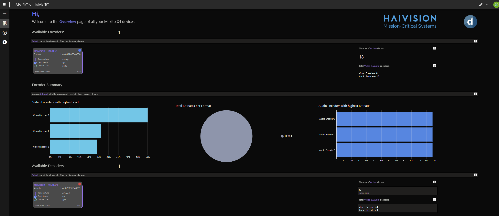
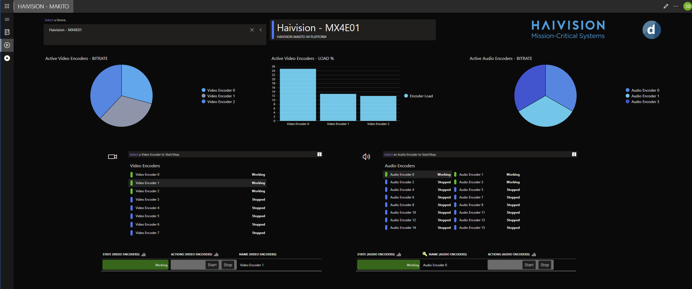

# Haivision Makito application

## About

The Haivision Makito application is designed to seamlessly integrate with the **Makito X4 Platform**, enhancing the functionality of both the **Makito X4 Encoder** and **Makito X4 Decoder**. This intuitive app provides a user-friendly interface for monitoring and managing your Makito X4 devices, offering clear and insightful visualizations of the system's status.

With real-time data displays, the app offers an in-depth view of key performance metrics, including signal strength, encoding/decoding rates, and other important statistics. This makes it easier for users to manage their video workflows, troubleshoot any issues, and ensure optimal performance. Whether you're streaming live events or working with high-quality video productions, the Makito app helps you stay on top of every detail, providing both a streamlined experience and valuable insights at your fingertips.

## Using the app

The app contains three pages:

- a device overview page,
- an encoder page, and
- a decoder page.

### Overview of all devices

The first page offers an overview of all your Makito devices, displaying the available encoders and decoders. Select a specific encoder or decoder to view its details.

In the overview, you can see the device's active alarms and key parameters. Below this, summary statistics for both encoders and decoders help identify any abnormal behavior quickly. The same statistical overview is provided separately for decoders underneath.

### Encoders

The second page focuses exclusively on Makito encoders.

At the top, you can select a specific encoder. The page displays active video and audio encoders along with their respective bit rates and load.

You also have the option to start or stop a selected video or audio encoder.

Additionally, you can monitor specific streams and their associated A/V encoders through trend charts for deeper analysis.

### Decoders

The third page is dedicated to Makito decoders, following the same structure as the encoder page.

You can select a specific decoder and start or stop an encoder directly from within the app. The page also displays the active decoder load.

Additionally, you can choose a stream and view the associated decoder and source. From there, you can load a trend chart for detailed monitoring.

## Prerequisites

- DataMiner version 10.5.1 or higher

- A DataMiner System [connected to dataminer.services](https://aka.dataminer.services/connectingtocloud)

- A connection to Makito X4 Platform devices, ideally at least one encoder and one decoder.

  > [!IMPORTANT]
  > For optimal performance and full compatibility, we strongly recommend using the **Haivision Makito X4 Platform Connector**.
  >
  > Please be aware that the Haivision Makito X Encoder and Decoder (older generations of the hardware) are deprecated and not supported by this application. The Makito X4 is a completely re-engineered, next-generation encoder/decoder that replaces the Makito X. It delivers significant advancements including 4K/UHD resolution, HDR, 10-bit 4:2:2 encoding, ultra-low latency, and enhanced network redundancy, making it ideal for modern IP-based and broadcast workflows.

- The DataMiner Haivision Makito app contains multiple functions that allow interaction with the Makito X4 devices available in the system. To ensure the app works properly and you have the most complete, it is necessary to have at least the following versions set to production:

  - **Haivision Makito X4 Platform connector version 1.1.0.2**

  > [!NOTE]
  > When you download the *Haivision Makito Application* package from the Catalog, this connector is not included. It needs to be installed separately.
